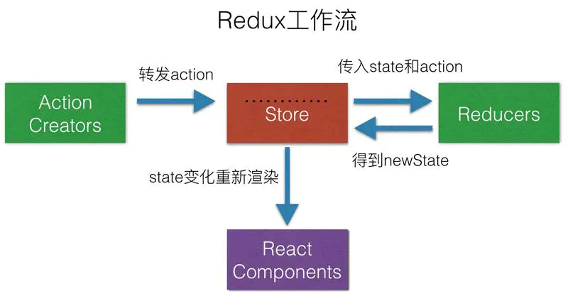

# React

## react简介

1. 采用**组件化**模式,**声明式编码**,提高开发效率及组件的复用率
2. 在React Native中可以使用React语法进行**移动端开发**
3. 使用**虚拟DOM**和优秀的**Diffing算法**,尽量减少与真实DOM的交互

```txt
关于虚拟DOM:
	1.本质是Object类型的对象
	2.虚拟DOM比较轻,真实DOM比较重
	3.虚拟DOM最终会被React转化为真实的DOM,呈现在页面上
```

## JSX语法规则

```txt
1. 定义VDOM时,不要写引号
2. 标签中混入js表达式时要用{}
3. 样式类名指定要使用className,不能是class,因为跟es6的类class冲突了
4. 内联样式,要用style={{key:value}}的形式
5. 根标签只能有一个
6. 标签必须闭合
7. 标签首字母:
   (1): 若小写字母开头,则将该标签转为html中同名元素,若html里无标签对应的元素,则报错
   (2): 若大写字母开头,react就去渲染对应的组件,若组件没有定义,则报错
```

## 组件

### 1.定义组件的两种方式

```txt
1.函数式组件
2.类式组件
	注意React.render(< ClassName />, app);react在render时,如果是首字母小写的类名,会默认去匹配html的标签名,只有大写的时候才当做一个组件,如果是函数,会执行这个函数;如果是类,内部会实例化这个类;
	函数组件里只能使用props,适用于简单组件,类组件可以使用state/props/refs,适用于复杂组件
比较:
1.类组件的性能消耗比较大，因为类组件需要创建类组件的实例，而且不能销毁。
2.函数式组件性能消耗小，因为函数式组件不需要创建实例，渲染的时候就执行一下，得到返回的react元素后就直接把中间量全部都销毁。
函数式组件是不能有状态的，但是现在有了react hooks，也可能有状态了。
```

### 2.组件实例的三大核心属性

#### 1. state

```txt
初始化: 在组件的constructor里定义(复杂组件),简单组件没有状态
修改: this.setState({})  不能直接修改,且更新是一种合并(不是替换)
```

#### 2. props

```txt
组件标签的所有属性都保存在props中,可以使用{...person}的方式批量传递属性
props是只读的,修改会报错
props做限制:添加静态属性propTypes/defaultProps, 15.5引入插件prop-types,从全局PropTypes上访问string,number...
props简写:静态属性可以直接在类中通过static的方式定义
```

#### 3. ref与事件处理

```txt
ref官方不建议大量使用
1. 字符串形式的ref,存在效率问题,官方不推荐使用
2. 回调函数形式的ref,内联的存在更新时的小问题无关紧要
3. React.createRef() API,官方最推荐的用法(需要创建容器)
```

```txt
1. 通过 onXxx 属性指定事件处理函数(注意大小写)
	React使用的是自定义(合成)事件,而不是使用的原生的DOM事件
	React中的事件是通过事件委托方式处理的(委托给组件最外层的元素)
2. 通过 event.target 得到事件的DOM元素对象
```

#### 高阶函数/函数的柯里化

```txt
高阶函数: 如果一个函数符合下面2个规范中的任何一个,那该函数就是高阶函数
	1.若A函数,接收的参数是一个函数,那么A就可以称之为高阶函数
	2.若A函数,调用的返回值依然是一个函数,那么A就可以称之为高阶函数
函数的柯里化:通过函数调用继续返回函数的方式,实现多次接收参数最后同一统一处理的函数编码形式
```

### 3.组件通信

1. 兄弟组件通信

   >  发布订阅者模式:  pubsubjs
   >
   >  ​	* 适用于任意组件间的通信
   >
   >  ​	* 要在组件的 componentWillUnmount 中取消订阅

## 生命周期函数

```txt
旧的生命周期函数:
  1. 初始化阶段:由ReactDOM.render()触发---初次渲染
  	constructor()
  	componentWillMount()
  	render()  (必须⭐)
  	componentDidMount()  (常用⭐) 一般用于初始化,发送网络请求/订阅消息
  2. 更新阶段:由组件内部this.setState()或父组件重新render触发
  	shouldComponentUpdate()
  	componentWillUpdate()
  	render()
  	componentDidUpdate()
  3.卸载组件:由ReactDOM.unmountComponentAtNode()触发
	componentWillUnmount()	(⭐)
新的生命周期函数:
	废弃了三个生命周期函数
	新增了 getDerivedStateFromProps  state完全取决于props
 		   getSnapshotBeforeUpdate 获取更新的快照,如滚动位置
```

## React 路由

### 1. SPA的理解

+ single page web application
+ 只有一个页面，点击链接不会刷新页面，只是局部更新

### 2. 路由的理解

+ 一个路由就是一个映射关系（key:value）
+ key为路径path，value 为 function（后端路由） 或 component（前端路由）

### 3. react-router

​	分为 web(react-router-dom)、native、any

#### 1. react-router-dom 使用

```jsx
import { Link, BrowserRouter } from 'react-router-dom'
<BrowserRouter><App /></BrowserRouter>	//需要用一个路由器来管理
<Link to="/home">Home</Link>	//相当于router-link
	Link 和 NavLink： NavLink 会自动加上 active 类，高亮效果
<Route path="/home" component={Home} />		//相当于router-view
	exact：开启严格匹配，会导致二级路由丢失的问题
```

```txt
路由组件this.props上有三个重要的属性
history:  go()  goBack()  goForward()  push()  replace()
location:  pathname  search  state
match:	params  path  url
```

```jsx
//Switch的使用
import {Switch, Route, Link } from 'react-router-dom'
<Switch>
 	//路由匹配成功之后,不会继续向下匹配,提高了性能   
   	<Route path="/home" component={Home1} />
   	<Route path="/home" component={Home2} />
</Switch>
```

#### 2. 路由传参

```txt
1. params参数
	<Route path="/home/message/:id">
	<Link to="/home/message/1">
	this.props.match.params
2. search参数
  <Link to="/message?name=zgx&age=19" />	
  this.props.location.search
  借助 query-string 库来parse(解析) 成对象
3. state参数
	<Link to={{pathname: '/home/message', state: {name: 'zgx', age: 10}}} />
	this.props.location.state
```

#### 3. 路由跳转模式

```txt
<Link redirect >   //redirect模式 push模式
```

#### 4. withRouter

```txt
this.props.history 只在路由组件中有,在一般的路由中没有这个属性
通过 export default withRouter(Navigate) 来包装组件,使其具有路由的api
```

#### 5. BrowserRouter 和 HashRouter 的区别:

```txt
1. browserRouter 使用后h5新提出的 history API,不兼容IE9一下的内容
2. hashRouter刷新后会导致路由的state参数丢失,browserRouter不会,因为state是保存在history对象里面
```

## React中使用antd

### 高级配置

1. 修改主题  借助carco实现,具体见官方文档

2. 按需引入antd的样式文件
   https://blog.csdn.net/qq_52135740/article/details/116649756

   ```js
   yarn add babel-plugin-import @babel/plugin-proposal-decorators
   //在craco.config.js文件下的module.exports添加如下代码
    babel:{  
       plugins: [
         ["@babel/plugin-proposal-decorators", { legacy: true }],
         [   
           "import", 
           {
             "libraryName": "antd",
             "libraryDirectory": "es",
              "style": true //设置为true即是less
            }
         ]
       ]
    },
   ```


## Redux

#### 1. 简介

> redux是一个专门用于状态管理的js库
>
> 可以用在react,angular,vue等项目中,但基本与react配置使用
>
> 作用: 集中式管理 react 应用中多个组件共享的状态

#### 2. redux原理



#### 3. redux 精简版

```txt
1. 创建 store.js 用于管理状态  import { createStote } from 'redux'
2. 创建 countReducer 用于处理状态的改变: reducer本质是一个函数，接受两个参数，之前的状态，动作对象
3. 页面展示通过  store.getState();
4. 监听 store 的变化，并且刷新页面 componentDidMount: store.subscribe(() => { this.setState() })
	或者在 index.js 中 store.subscribe(() => { ReactDOM.render(<App />, document.getElementById('root')) })
```

#### 4. redux完整版

```text
增加了两个文件: 
	1. count_action.js  专门用于创建action对象
		export const createIncrementAction = data => ({ type: INCREMENT, data })
	2. constant.js  防止编码错误,定义常量
		export const INCREMENT = 'increment';
```

#### 5. 异步action

```txt
借助中间件实现
	1. yarn add redux-thunk; 
	   import thunk from 'redux-thunk';  
	   import {applyMiddleWare} from 'redux'; 
	   createStore(countReducer, applyMiddleWare(thunk))
	2. const asyncAction = (data, time) => {
			return (dispatch) => {
				setTimeout(() => dispatch(action, data), time)
			}
	   }
```

#### 6. 使用react-redux

```txt
在之前的基础上,增加容器组件和UI组件,UI组件负责与页面的渲染与逻辑处理,通过props与容器组件交互;容器组件是UI组件的父组件,负责与redux交互
containers/Count/index.jsx:
	1. import {connect} from 'react-redux';  export default connect(mapStateToProps, mapDispatchToProps)(CountUI);
	2. const mapStateToProps = state => { return { count: state } }
	3. const mapDispatchToProps = dispatch => { return { increment: value => dispatch(createIncrementAction(value)) } }
	4. mapStateToProps是一个函数,返回状态; mapDispatchToProps返回操作状态的方法
```

#### 7. react-redux的优化

```txt
export default connect(
  state => ({ count: state }),
  {			//mapDispatchToProps 可以是一个对象
    increment: createIncrementAction,		//react-redux会自动调用 dispatch
  }
)(CountUI)
```

```txt
可以不用在index.js中监测redux状态的改变,react-redux已经做了监测
```

```txt
借助 provider 组件可以给所有需要用到store的组件注入store
import {Provider} from 'react-redux'
<Provider store={store}><App /></Provider>
```

```txt
将容器组件和UI组件合并到一个jsx文件中
```

#### 8. react-redux数据共享

```txt
redux/actions/Count  redux/actions/Person
redux/reducers/Count  redux/reducers/Person
store.js  	import {combineReducers} from 'redux'
createStore(combineReducers({ count: countReducer, person: personReducer }))
在容器组件中:  state: {count: state.count, person: state.person}
```

#### 9. 纯函数

```txt
只要是同样的输入,必须得到同样的输出
必须遵守以下规则:
	不得改写数据
	不会产生任何副作用,例如网络请求,输入和输出设备
	不能调用 Date.now() 或 Math.random() 等方法
redux 中的 reducer 必须是一个纯函数
	reducer中: 返回必须是一个不同于preState的对象或值,因此不能使用 unshift 返回 preState
```

#### 10. 使用redux-devtools查看redux状态管理

```txt
1. yarn add redux-devtools-extension
2. import { composeWithDevTools } from 'redux-devtools-extension'
3. createStore(countReducer, composeWithDevTools(applyMiddleWare(thunk)))
```

#### 11. redux最终版

```txt
1. 简化名称,使用对象简写的方式
2. 新增 redux/reducers/index.js, 整合暴露所有的 reducer
```


## React脚手架

### 脚手架介绍

1. 技术架构: react + webpack + es6 + eslint
2. 特点: 模块化 组件化 工程化

### 脚手架使用

1. `npm i -g create-react-app`
2. `create-react-app hello-react`
3. `cd hello-react`
4. `npm run start`


## React扩展

### 1. setState

```txt
1. 对象式的 setState
	this.setState({count: 99})
2. 函数式的 setState
	this.setState((state, props) => {
		return {count: state.count + 1}
	})
3. 当修改的对象依赖于之前的状态时,推荐用函数式的 setState, 可以在setState的第二个参数(回调函数)中获取更新后的值(因为是异步更新)
```

### 2. 路由懒加载 lazyLoad

```txt
1. import {lazy, Suspense} from 'react'; 
   import Loading from './components/Loading'
2. const Home = (() => import('./Home'))
3. <Suspense fallback={ Loading }><Route path="/home" component={Home} /></Suspense>
```

### 3. Hooks

#### 1.React Hook/Hooks 是什么

```txt
1. Hook 是 react 16.8版本增加的新特性/新语法
2. 可以让你在函数式组件中使用 state 以及其他的 React 特性
```

#### 2. 三个常用的 Hook

```;txt
1. State Hook: React.useState
	(1).State Hook 让函数组件也可以有state状态,并进行状态数据的读写操作
	(2).语法: const [name, setName] = React.useState('tom')
	(3).useState的参数为初始值,会在内部作缓存;返回一个状态值和更新状态值的函数的数组
	(4).setName有两种写法: setName(newValue);  setName(value => newValue);
```

```txt
2. Effect Hook: React.useEffect
	(1).Effect Hook 让函数组件中也可以执行副作用操作(用于模拟类组件中的生命周期钩子)
	(2).React中的副作用操作:
		发送Ajax请求获取数据
		设置订阅 / 启动定时器
		手动更改真实DOM
	(3).语法:
		useEffect(() => {
			// 在此可以执行任何带副作用操作
			// 返回一个函数 相当于 componentWillUnmount
			return () => {}
		}, [stateValue]) //如果指定的是[], 回调函数只会在第一次render()后执行
	(4).可以把 useEffect Hook 看成如下三个函数的组合
		componentDidMount()
		componentDidUpdate()
		componentWillUnmount()
```

```txt
3. Ref Hook
	(1).Ref Hook可以在函数组件中存储/查找组件内的标签或任意其他数据
	(2).const refContainer = useRef()
	(3).作用: 保存标签对象,功能与React.createRef()一样
```

### 4. Fragment

```txt
import {Frament} from 'react'
Fragment相当于vue中的template,可以且仅可以写key值
<></>空标签同样不会渲染,区别在于<>不能写任何属性值
```


# 补充:

+ react项目中使用css模块化

  ```txt
  1.样式文件需要设置名称为 index.module.css
  2.import hello from './index.module.css'
    <div className={hello.title}></div>
  ```

+ react脚手架配置代理

  ```txt
  1.方法一: package.json中添加
  	"proxy": "http://localhost:3001"
  2.方法二:
  	添加/src/setupProxy.js
      const proxy = require('http-proxy-middleware');
      module.exports = (app) => {
        app.use(
          proxy('/api1', {
            target: 'http://localhost:3001',
            changeOrigin: true,
            pathRewrite: { '^/api1': '' }
          })
        )
      }
  ```

+ fetch

  ```txt
  fetch 原生函数，不再使用 XMLHTTPRequest发送ajax请求
  但是老版本浏览器可能不兼容
  关注分离的设计思想
  
  fetch(url,options).then(response => response.json())
  	.then(data => console.log(data))
  	.catch(err => console.log(err))
  ```

- react 中插槽的用法

  ```txt
  react中没有vue中类似的插槽的概念，但是react将标签中间的内容放在了 this.props.children 属性上，可以在children上获取内容，也可以将children属性直接放在组件上，同样会展示出来
  ```

- pubic_url

  ```txt
  %PUBLIC_URL%  表示 public 文件夹所在的绝对路径
  ```

  

